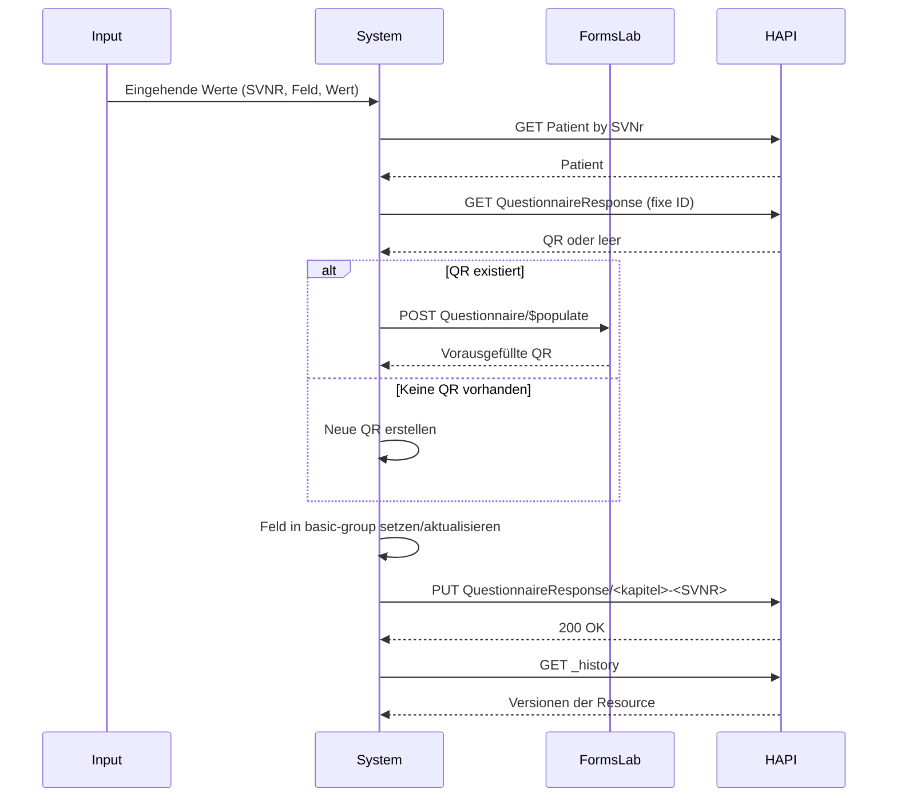

# FHIR QuestionnaireResponse Workflow

**Version:** 1.0  
**Standard:** HL7 FHIR R4  
**Infrastruktur:** HAPI FHIR Server (lokal) · Forms-Lab (extern)

---

## Inhaltsverzeichnis

1. [Systemarchitektur](#systemarchitektur)
2. [Ressourcen-ID-Strategie](#ressourcen-id-strategie)
3. [Modul 1 – MergeLogic](#modul-1--mergelogic)
4. [Modul 2 – StoreLogic](#modul-2--storelogic)
5. [Vergleich: MergeLogic vs. StoreLogic](#vergleich-mergelogic-vs-storelogic)
6. [Infrastruktur & Hilfsskripte](#infrastruktur--hilfsskripte)
7. [Systemvoraussetzungen](#systemvoraussetzungen)
8. [Deployment & Ausführungsreihenfolge](#deployment--ausführungsreihenfolge)
9. [Haftungsausschluss](#haftungsausschluss)

---

## Systemarchitektur

Dieses Repository demonstriert einen automatisierten Workflow zur Verarbeitung medizinischer Fragebögen auf Basis des HL7 FHIR R4 Standards. Es zeigt zwei verschiedene Strategien zur Speicherung von Patientenantworten als `QuestionnaireResponse`-Ressourcen.

Die Implementierung nutzt ein hybrides Server-Setup:

| Rolle | URL |
|---|---|
| HAPI FHIR Server (lokal) | `http://localhost:8080/fhir` |
| Forms-Lab Server (extern) | `https://fhir.forms-lab.com` |

Beide Module arbeiten mit derselben grundlegenden Eingabestruktur:

| Parameter | FHIR-Feld | Beispiel | Beschreibung |
|---|---|---|---|
| `SVNr` | `identifier.value` | `1234567890` | Patienten-Identifikator (Sozialversicherungsnummer) |
| `Kapitel` | `questionnaire` | `schwangerschaft` | Kapitelname, der einem Questionnaire zugeordnet wird |
| `DEK-Feld` | `item[].linkId` | `gewicht` | Feldbezeichner innerhalb der QuestionnaireResponse |
| `Wert` | `item[].answer[]` | `{ "valueDecimal": 68.5 }` | Typisierter FHIR-Antwortwert |

---

## Ressourcen-ID-Strategie

Das Repository folgt klaren Namenskonventionen für FHIR-Ressourcen:

| Ressource | ID-Muster | Beispiel |
|---|---|---|
| `Questionnaire` | `<kapitelname>` | `kapitel-schwangerschaft` |
| `QuestionnaireResponse` – MergeLogic | `<questionnaire-id>-<SVNR>` | `kapitel-schwangerschaft-1234567890` |
| `QuestionnaireResponse` – StoreLogic | `<kapitel>-qr-<timestamp>` | `schwangerschaft-qr-20260417143012` |

Das bedeutet: **MergeLogic** schreibt immer in dieselbe Ressource für einen Patienten und ein Kapitel, während **StoreLogic** bei jeder Ausführung eine neue Ressource anlegt.

---

## Modul 1 – MergeLogic

**Datei:** `_MergeLogic.py`

### Strategie: Idempotentes Upsert

MergeLogic verwendet eine zusammenführungsbasierte Aktualisierungsstrategie. Ziel ist es, eine einzige persistente `QuestionnaireResponse` pro Patient und Fragebogen zu pflegen. Neue Werte werden in die bestehende Ressource integriert, unveränderte Daten bleiben erhalten.


### Verarbeitungsschritte

1. `Questionnaire`-Referenz aus dem Kapitelnamen auflösen
2. `Patient` anhand der `SVNr` auf dem HAPI FHIR Server suchen
3. Neueste vorhandene `QuestionnaireResponse` für Patient und Fragebogen abrufen
4. Falls eine Response existiert, eingehende Felder in die bestehende Ressource zusammenführen
5. Falls keine Response existiert, neue `QuestionnaireResponse` anlegen
6. Ergebnis via `PUT QuestionnaireResponse/<questionnaire-id>-<SVNR>` speichern

### Zusammenführungsverhalten

- Vorhandene `linkId` → Antwort wird **überschrieben**
- Neue `linkId` → Element wird **angehängt**
- Die Zusammenführung erfolgt innerhalb des `basic-group`-Containers
- Die resultierende Ressource behält eine **stabile und deterministische ID**

---
## Modul 2 – StoreLogic

**Datei:** `_StoreLogicTest.py`

### Strategie: Update mit Versionierung + $populate

StoreLogic verwendet eine aktualisierungsbasierte Strategie mit einer festen `QuestionnaireResponse`-ID.  
Anstatt bei jeder Ausführung eine neue Ressource zu erzeugen, wird dieselbe `QuestionnaireResponse` unter derselben ID aktualisiert.

Die Historie der Änderungen wird dabei automatisch durch den HAPI FHIR Server über die technische Versionierung (`_history`) gespeichert.

Zusätzlich wird `$populate` verwendet, um bestehende Antworten vor dem Update automatisch zu übernehmen.

---

### Verarbeitungsschritte

1. `Questionnaire`-Referenz aus dem Kapitelnamen auflösen  
2. `Patient` anhand der `SVNr` suchen  
3. Bestehende `QuestionnaireResponse` über feste ID abrufen:  
   `<kapitel>-<SVNR>`  
4. Falls eine Response existiert → `$populate` auf Forms-Lab aufrufen  
5. Falls keine Response existiert → neue leere QR erstellen  
6. `basic-group` sicherstellen  
7. DEK-Feld setzen oder aktualisieren  
8. QR via `PUT QuestionnaireResponse/<kapitel>-<SVNR>` speichern  

---

### Verhalten

- Vorhandene Werte bleiben erhalten (durch `$populate`)  
- Geänderte Felder werden überschrieben  
- Neue Felder werden ergänzt  
- Die ID bleibt konstant  
- Änderungen werden als Versionen in `_history` gespeichert  

---

### Sequenzdiagramm



---

## Vergleich: MergeLogic vs. StoreLogic

| Aspekt | MergeLogic | StoreLogic |
|---|---|---|
| Strategie | Idempotentes Upsert | Event Sourcing (Append-only) |
| Ressourcenanzahl | 1 QR pro Patient pro Kapitel | 1 neue QR pro Ausführung |
| Historie | Keine Versionshistorie | Vollständiger Audit-Trail |
| ID-Schema | `<questionnaire-id>-<SVNR>` | `<kapitel>-qr-<timestamp>` |
| Externe Abhängigkeit | Keine | Forms-Lab `$populate` |
| Wiederholungssicherheit | Sicher (idempotent) | Erzeugt zusätzliche Einträge |
| Anwendungsfall | Single Source of Truth | Längsschnitterfassung / Auditing |

---

## Infrastruktur & Hilfsskripte

**`setup.py`** — Initialisiert den HAPI FHIR Server mit Testdaten: einen Beispiel-`Questionnaire`, einen Demo-`Patient` (Anna Mustermann, SVNr `1234567890`) sowie eine bereits vorhandene `QuestionnaireResponse`.

**`cleanUp.py`** — Löscht alle `QuestionnaireResponse`-Ressourcen vom HAPI FHIR Server. Nach Testläufen verwenden, um einen sauberen Ausgangszustand wiederherzustellen.

---

## Systemvoraussetzungen

| Anforderung | Detail |
|---|---|
| Python | 3.10 oder neuer |
| Abhängigkeit | `pip install requests` |
| FHIR Server | HAPI FHIR läuft lokal via Docker auf Port `8080` |
| Netzwerk | Internetzugang erforderlich für Forms-Lab (`$populate`) |

---

## Deployment & Ausführungsreihenfolge

```bash
# 1. Testdaten initialisieren
python _Setup.py

# 2. MergeLogic ausführen (idempotentes Upsert)
python _MergeLogic.py

# 3. StoreLogic ausführen (Event Sourcing)
python _StoreLogicTest.py

# 4. QuestionnaireResponse-Ressourcen bereinigen
python cleanUp.py
```

---

## Haftungsausschluss

Alle in diesem Repository verwendeten Patientendaten, Identifikatoren und klinischen Werte sind synthetische Demodaten, die ausschließlich für Entwicklungs- und Testzwecke erstellt wurden. Diese Implementierung ist nicht für den Produktiveinsatz oder den klinischen Betrieb validiert.